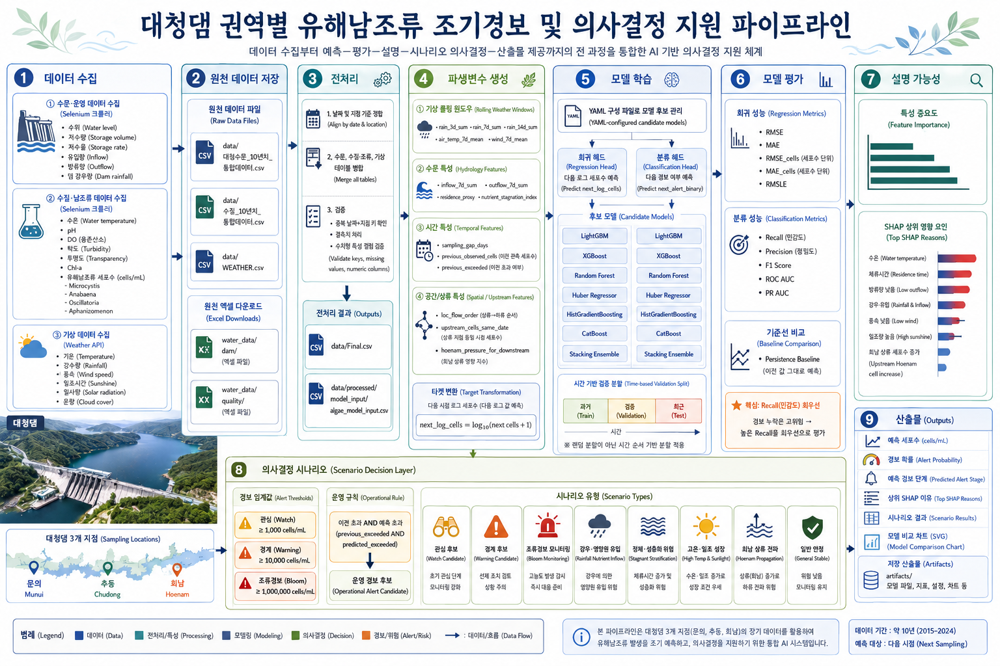
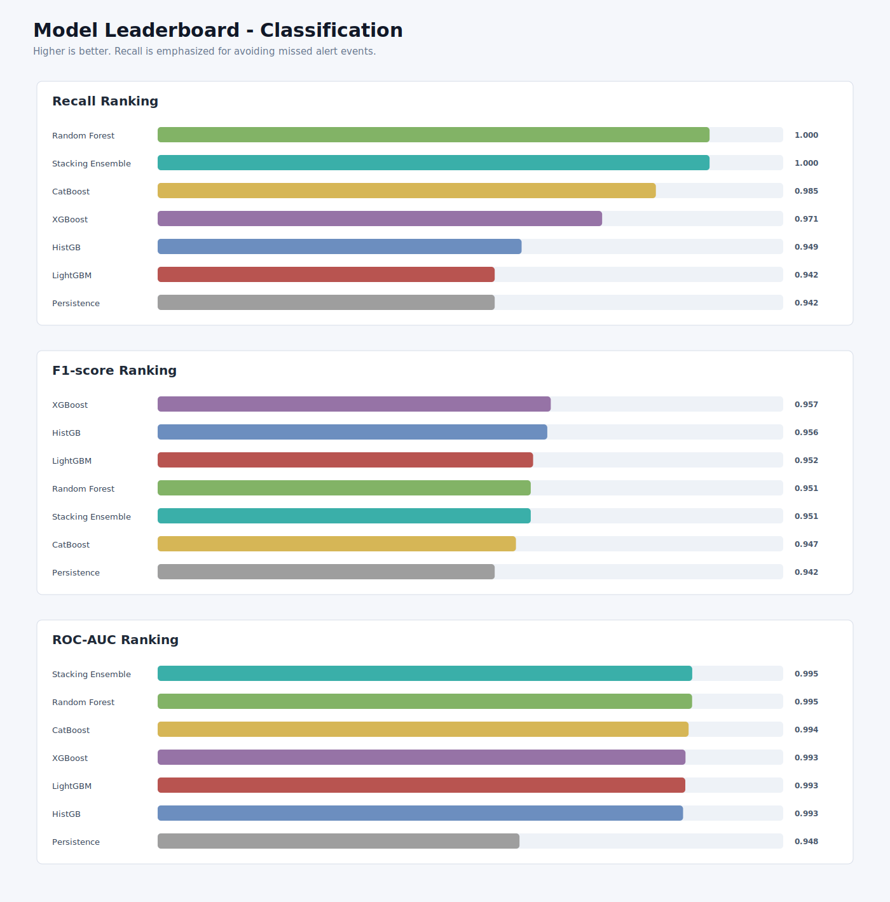
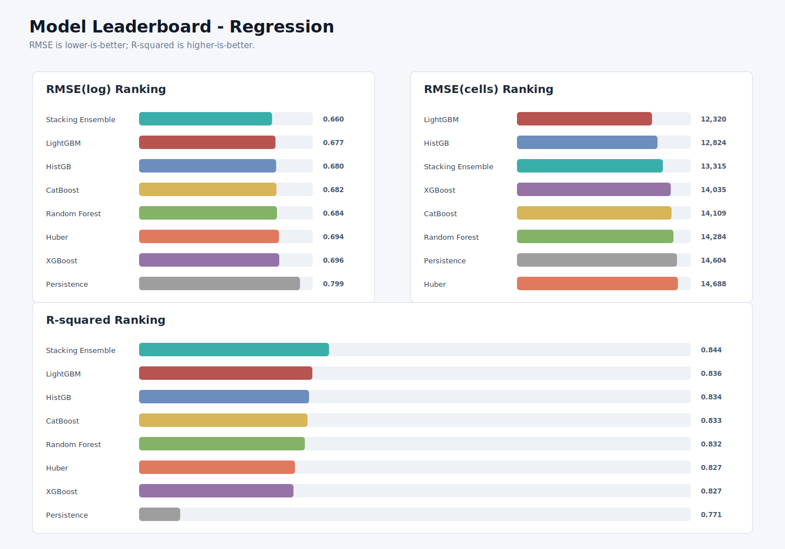
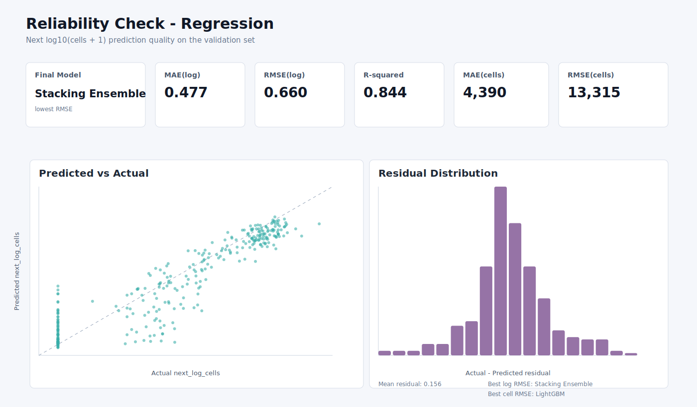
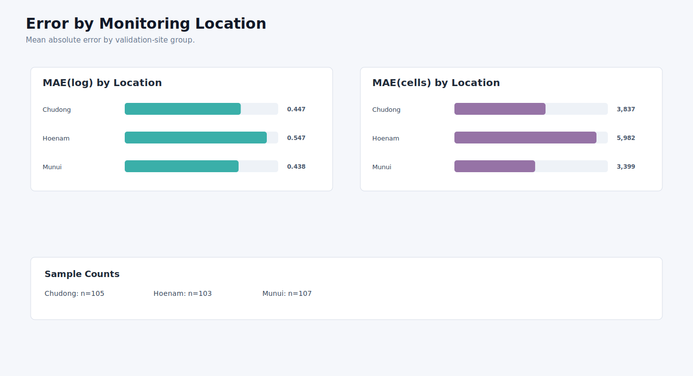
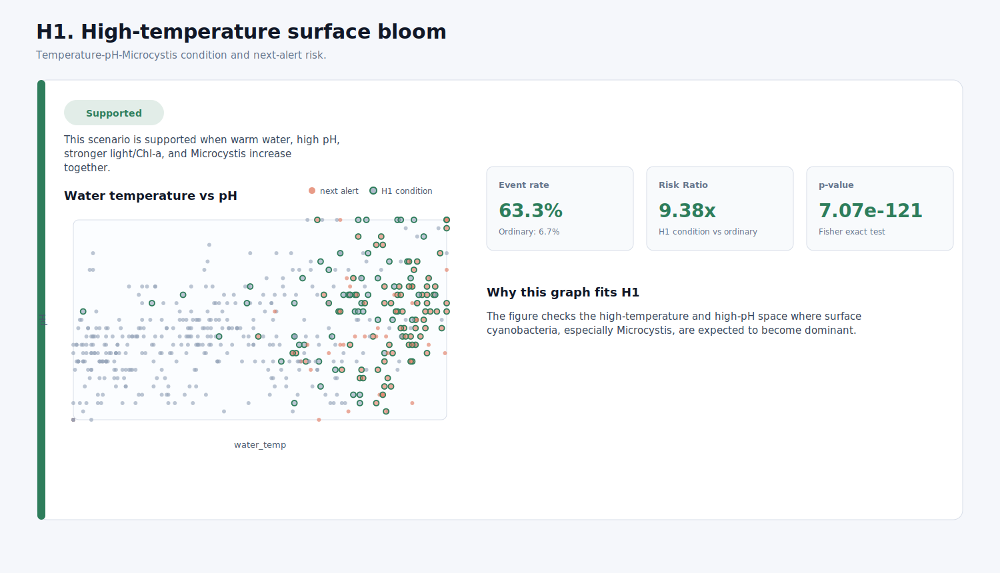
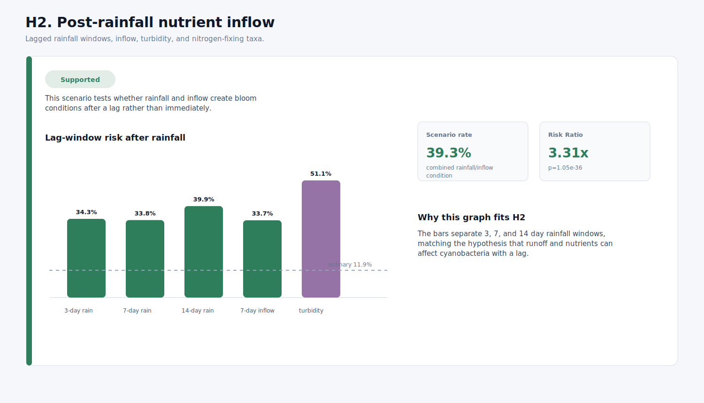
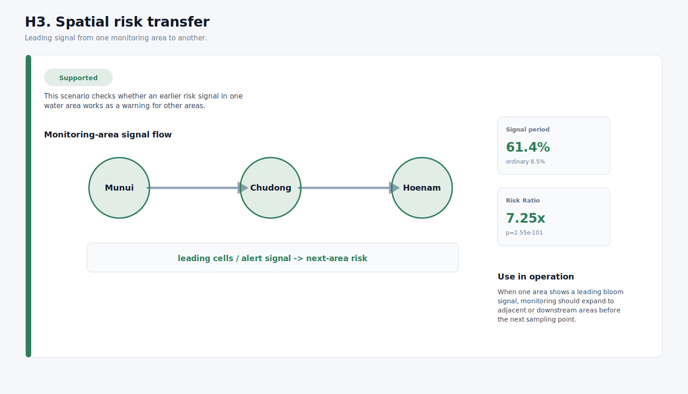
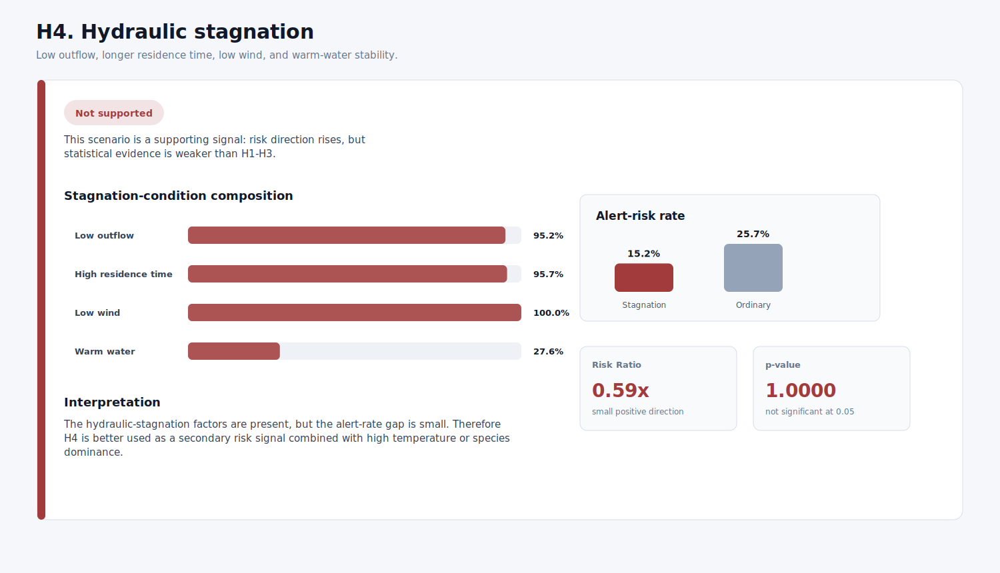
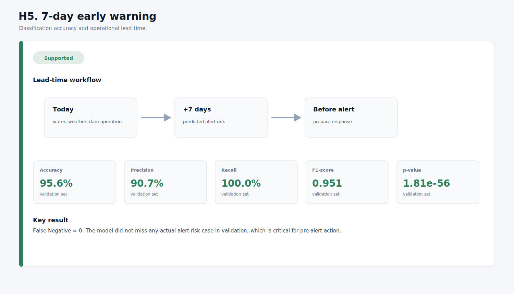

# 대청댐 수역별 유해남조류 선행 예측 및 의사결정 지원 모델

<p align="center">
  
  
  
  
  
  
</p>

<p align="center">
  
</p>

대청댐과 대청호 수역의 수질, 유해남조류, 댐 운영, 기상 데이터를 통합하여 다음 채수 시점 또는 약 7일 후의 유해남조류 위험을 예측하는 AI/AX 기반 의사결정 지원 프로젝트입니다.

본 과제는 현행 조류경보제를 대체하기 위한 시스템이 아니라, 경보 발령 이전 단계에서 위험 가능성과 판단 근거를 제공하여 물관리자의 선제 대응을 돕는 보완적 분석 체계입니다.

## 목차

- [1. 문제 배경과 과제 정의](#1-문제-배경과-과제-정의)
- [2. 핵심 가설](#2-핵심-가설)
- [3. 전체 파이프라인](#3-전체-파이프라인)
- [4. 디렉토리 구조](#4-디렉토리-구조)
- [5. 데이터 구성](#5-데이터-구성)
- [6. Feature Engineering](#6-feature-engineering)
- [7. 모델 구성](#7-모델-구성)
- [8. 모델 결과](#8-모델-결과)
- [9. 실행 방법](#9-실행-방법)
- [10. Makefile 사용법](#10-makefile-사용법)
- [11. 주요 산출물](#11-주요-산출물)
- [12. 그래프와 보고서 확인](#12-그래프와-보고서-확인)
- [13. 재현 시 주의사항](#13-재현-시-주의사항)

## 1. 문제 배경과 과제 정의

### 1.1 사회적·환경적 당면 과제

대청댐과 대청호는 지역 수자원 공급과 수질관리 체계에 연결된 핵심 수역입니다. 유해남조류 발생은 단순한 자연현상을 넘어 공급 수질관리, 취수·정수 운영, 행정 대응의 문제로 이어집니다. 조류경보제의 판단 기준은 결국 유해남조류 세포 수에 기반하므로, `Microcystis`, `Anabaena`, `Oscillatoria`, `Aphanizomenon` 등 주요 유해남조류 4종의 발생 가능성을 사전에 파악하는 것은 수질관리의 출발점이 됩니다.

특히 고수온, 강수 패턴 변화, 영양염류 유입, 방류량 변화, 체류시간 증가는 조류 발생 조건을 복합적으로 변화시킵니다. 따라서 본 과제는 대청호 녹조 문제를 단일 수질 항목의 변화가 아니라 수질, 기상, 댐 운영, 수역 특성이 결합된 예측 문제로 정의합니다.

### 1.2 현행 조류경보제의 역할과 한계

현행 조류경보제는 유해남조류 세포 수 측정 결과를 바탕으로 관심, 경계, 대발생 단계를 발령하고 단계별 대응을 수행하도록 하는 공식 관리체계입니다. 이 체계는 관측된 위험을 행정적으로 판단하고 대응하는 데 필수적입니다.

다만 채수와 분석 결과를 기준으로 위험을 확인하는 구조만으로는 경보 발령 이전의 위험 수역을 사전에 식별하는 데 한계가 있습니다. 또한 조류 발생은 강수, 수온, 유입량, 정체 조건 등이 시간차를 두고 작용할 수 있어 현재 측정값만으로 다음 위험을 설명하기 어렵습니다.

본 과제는 기존 제도를 대체하려는 것이 아니라, 조류경보 이전 단계에서 위험 가능성과 판단 근거를 제공하여 현행 대응체계를 보완하는 AX 기반 의사결정 지원체계로 위치합니다.

### 1.3 정책 및 제도와의 정합성

정책적으로도 본 과제의 방향은 현행 조류예측 체계와 정합성이 있습니다. 조류예측 관련 규정은 조류예측 기간을 발표일로부터 7일간으로 정하고, 예측 항목으로 수온과 유해남조류 세포수를 명시합니다. 또한 조류예측 정보 생산을 위해 기상, 수질, 유량, 위성영상 등 다양한 관측자료를 분석하도록 규정하고 있습니다.

이에 따라 본 과제는 대청댐 수질정보, 댐 운영정보, 기상정보를 결합하여 다음 채수 시점 또는 약 7일 후의 위험을 예측하는 구조로 설계했습니다. 이는 조류경보 발령 이후의 대응만이 아니라 발령 전 위험 판단을 지원하는 보완적 분석 체계라는 점에서 의미가 있습니다.

### 1.4 예측 대상 및 문제 정의

본 과제의 예측 대상은 현재 상태의 단순 분류가 아니라 다음 채수 시점의 유해남조류 위험입니다.

회귀 관점에서는 다음 시점 유해남조류 세포 수를 로그 변환한 값을 예측합니다.

```text
next_log_cells = log10(next harmful cyanobacteria cells + 1)
```

분류 관점에서는 다음 시점에 관심 기준 이상 위험이 발생할 가능성을 예측합니다.

```text
next_alert_binary = next cells >= 1,000 cells/mL
```

이 구조는 세포 수 규모를 예측하는 문제와 경보 기준 초과 가능성을 탐지하는 문제를 함께 다루기 위한 것입니다. 특히 조류경보 운영에서는 단순한 전체 정확도보다 실제 위험을 놓치지 않는 탐지 능력이 중요하므로, 본 과제는 지속모델과 비교하여 통합 예측 구조의 개선 가능성을 검증합니다.

### 1.5 경보 기준

| 단계 | 유해남조류 세포 수 기준 |
| --- | ---: |
| 안정 또는 일반 관찰 | 1,000 cells/mL 미만 |
| 관심 | 1,000 cells/mL 이상 |
| 경계 | 10,000 cells/mL 이상 |
| 조류대발생 | 1,000,000 cells/mL 이상 |

운영상으로는 직전 관측값과 다음 시점 예측값을 함께 봅니다.

```text
previous_exceeded AND predicted_exceeded = operational alert candidate
```

즉, 이전 채수에서 관심 기준을 넘었고 다음 채수 시점도 기준 초과가 예상되면 조류경보 후보 시나리오로 해석합니다.

## 2. 핵심 가설

본 과제는 대청호 유해남조류 발생을 수질, 기상, 댐 운영, 수역 변화가 함께 작용하는 복합 현상으로 봅니다. 아래 정량 수치는 확정된 결과가 아니라 본 분석에서 검증할 기대효과 가설입니다.

### 2.1 고수온·정체 조건 기반 조류 증식 가설

수온이 높고 pH가 상승하는 시기에는 유해남조류 세포 수가 증가하고 관심 기준 이상 발생 가능성이 높아질 것입니다. 고수온과 높은 pH 조건은 남조류 증식에 유리한 환경을 만들 수 있으며, 특히 `Microcystis`가 여름철 고수온·고pH 조건에서 우점할 가능성이 높습니다.

또한 정체 조건이 함께 나타날 경우 표층에 머무르는 남조류가 축적되면서 `Microcystis` 중심의 세포 수 증가가 더 뚜렷하게 나타날 수 있습니다. 본 분석에서는 해당 조건의 관심 기준 이상 발생 가능성이 일반 기간보다 약 1.5~2배 높아지는지 검증합니다.

연계 시나리오:

- 고수온 표층 증식 위험 구간
- 수온 상승, pH 상승, 일조시간 증가, Chl-a 증가, `Microcystis` 세포 수 증가 감지
- 모니터링 강화, 조류차단막 운영 검토, 취수구 주변 집중 점검, 정수처리 강화 준비

### 2.2 강수 이후 유입 조건의 시차 효과 가설

집중강우 이후 유입량, 탁도, 영양염류 변화는 일정한 시차를 두고 유해남조류 증가에 영향을 줄 것입니다. 강수 이후 상류 유역의 토사, 부유물질, 질소·인 등 영양염류가 대청호로 유입될 수 있으며, 이러한 유입 조건은 즉각적인 세포 수 증가보다 며칠 뒤 조류 성장 조건을 형성할 가능성이 높습니다.

특히 질소고정 능력을 가진 `Anabaena`와 `Aphanizomenon`은 질소 제한 조건에서도 인 공급이 충분할 경우 경쟁 우위를 가질 수 있어, 강수 이후 영양염류 변화와 시차 효과를 함께 검증할 필요가 있습니다. 본 분석에서는 강수 이후 3-14일 구간에서 관심 기준 이상 발생 가능성이 약 20~50% 높아지는지 검증합니다.

연계 시나리오:

- 강수 후 영양염류 유입 위험 구간
- 누적강수량 증가, 일유입량 증가, 탁도 상승, 영양염류 유입 가능성 감지
- `Anabaena` 또는 `Aphanizomenon` 세포 수 증가 신호 반영
- 상류 오염원 점검, 부유물질 수거, 오탁방지막·조류차단막 설치 검토, 취수구 주변 모니터링 강화

### 2.3 수역 간 선행 신호 가설

문의, 추동, 회남 중 특정 수역의 세포 수 증가 신호는 다른 수역의 미래 위험을 예측하는 선행 정보가 될 것입니다. 대청호 내 수역은 수문 흐름, 기상 조건, 유입 조건을 공유하며 특정 수역에서 먼저 나타난 유해남조류 증가 신호가 시차를 두고 다른 수역의 위험 변화와 연결될 수 있기 때문입니다.

선행 신호는 총 유해남조류 세포 수뿐 아니라 `Microcystis`, `Anabaena`, `Oscillatoria`, `Aphanizomenon`의 종별 우점 변화로도 나타날 수 있습니다. 본 분석에서는 선행 신호가 나타난 뒤 다른 수역의 관심 기준 이상 발생 가능성이 일반 기간보다 약 10~30% 높아지는지 검증합니다.

연계 시나리오:

- 수역별 위험 전이 시나리오
- 특정 수역의 세포 수 급증, Chl-a 증가, 관심 이상 확률 상승 감지
- 인접 또는 하류 수역의 위험 예측에 선행 신호 반영
- 모니터링 범위 확대, 방제장비와 취·정수 대응 준비 우선순위 조정

### 2.4 방류량 감소 및 체류시간 증가에 따른 경보 위험 확대 가설

방류량이 감소하고 체류시간이 길어지는 시기에는 유해남조류가 수체 내에 머무르는 시간이 늘어나 조류경보 관심 기준을 초과할 가능성이 높아질 것입니다. 특히 정체 조건이 고수온·저풍속 조건과 함께 나타날 경우 수체 혼합이 약해지고 특정 수역에서 세포 수 증가가 더 뚜렷하게 나타날 수 있습니다.

이 가설은 표층에 축적되기 쉬운 `Microcystis`, 성층 및 수층 안정화 조건과 연결되는 `Oscillatoria`, 안정된 수층에서 증가 가능성이 있는 `Aphanizomenon`과 관련됩니다. 본 분석에서는 방류량 감소와 체류시간 증가가 동반된 기간의 관심 기준 이상 발생 가능성이 일반 기간보다 약 1.5~2배 높게 나타나는지 검증합니다.

연계 시나리오:

- 정체 조건 심화 시나리오
- 일방류량 감소, 저풍속 지속, 고수온 조건 감지
- `Microcystis`, `Oscillatoria`, `Aphanizomenon` 세포 수 증가 신호 반영
- 물순환설비 가동, 방류량 조정 검토, 수위 운영 검토, 취수구 주변 조류 유입 차단 조치

### 2.5 7일 리드타임 기반 선제 대응 가설

약 7일 후의 유해남조류 위험을 사전에 예측할 수 있다면 조류경보 발령 전 대응 준비에 활용될 수 있습니다. 현행 조류예측 관련 규정에서도 조류예측 기간을 발표일로부터 7일간으로 두고 있으며, 예측 항목으로 수온과 유해남조류 세포수를 명시하고 있습니다.

따라서 본 분석에서는 총 유해남조류 세포 수뿐 아니라 `Microcystis`, `Anabaena`, `Oscillatoria`, `Aphanizomenon`의 종별 세포 수 변화를 함께 고려하여 관심 이상 위험 사례를 약 7일 내외 앞서 식별할 수 있는지 검증합니다.

연계 시나리오:

- 7일 선제 대응 시나리오
- 다음 채수 시점 또는 약 7일 후 관심 이상 위험 예측
- 위험 수역 모니터링 강화
- 우점 가능 종에 따른 제거선, 방제장비, 취수 수심 변경, 활성탄·오존 등 정수처리 강화 준비

## 3. 전체 파이프라인

```text
수문 Selenium 크롤링
        |
수질/조류 Selenium 크롤링
        |
기상 API 수집
        |
원천 CSV 생성
        |
전처리 및 날짜/수역 병합
        |
Feature Engineering
        |
회귀/분류 후보 모델 학습
        |
모델 평가 및 best model 선택
        |
예측값, 지표, SHAP 설명, 시나리오 산출
        |
그래프와 보고서용 산출물 저장
```

파이프라인의 중심 실행 파일은 [src/pipeline.py](src/pipeline.py)입니다. 처음 실행하는 사용자는 OS별 wrapper script인 `run_pipeline.ps1` 또는 `run_pipeline.sh`를 사용하는 것이 가장 쉽습니다.

## 4. 디렉토리 구조

```text
model/
  README.md
  requirements.txt
  Makefile
  run_pipeline.ps1
  run_pipeline.sh

  config/
    model_config.yaml

  docs/
    notion_pipeline_summary.md
    pipeline_image_prompt.md
    img/
      pipeline_image.png
      reliability_classification_leaderboard.svg
      reliability_regression_leaderboard.svg
      reliability_regression_summary.svg
      reliability_error_by_location.svg
      hypothesis_h1_result.svg
      hypothesis_h2_result.svg
      hypothesis_h3_result.svg
      hypothesis_h4_result.svg
      hypothesis_h5_result.svg

  src/
    pipeline.py
    water_gate.py
    water_quality.py
    weather_api.py
    fetch_10y.py
    preprocess_data.py
    train_models.py
    models.py
    features.py
    config.py
    model_config.py
    loader.py
    persistence.py
    explain_scenario.py
    plot_metrics.py
    plot_reliability.py
    run_hypothesis_tests.py
    llm_publisher.py

  data/
    대청수문_10년치_통합데이터.csv
    수질_10년치_통합데이터.csv
    WEATHER.csv
    Final.csv
    processed/model_input/algae_model_input.csv

  water_data/
    dam/
    quality/

  artifacts/
    models/
    metrics/
    predictions/
    explain/
    scenario/
    figures/

  output/
    run_YYYYMMDD_HHMMSS/
```

### 주요 파일 설명

| 파일 | 설명 |
| --- | --- |
| `src/pipeline.py` | 전체 수집, 전처리, 학습, 그래프 생성 흐름을 제어합니다. |
| `src/water_gate.py` | K-water 대청댐 수문·운영 데이터를 Selenium으로 다운로드하고 병합합니다. |
| `src/water_quality.py` | 조류 및 수질 자료를 Selenium으로 다운로드하고 병합합니다. |
| `src/weather_api.py` | 기상 데이터를 수집하고 `WEATHER.csv`를 생성합니다. |
| `src/preprocess_data.py` | 수문, 수질, 기상 데이터를 날짜와 수역 기준으로 병합하고 모델 입력 테이블을 만듭니다. |
| `src/features.py` | 이전 관측값, 수역 흐름 순서, 상류 영향, 샘플링 간격 feature를 생성합니다. |
| `src/models.py` | 후보 회귀·분류 모델을 생성하고 평가합니다. |
| `src/train_models.py` | 학습, 평가, 예측, SHAP, 시나리오 생성을 실행합니다. |
| `src/explain_scenario.py` | 예측 결과를 경보 단계와 운영 시나리오로 변환합니다. |
| `src/persistence.py` | 모델, 지표, 예측값, run report를 저장합니다. |
| `src/plot_metrics.py` | 모델 비교 SVG 그래프를 생성합니다. |
| `src/plot_reliability.py` | 분류 성능 순위, 회귀 신뢰도, 수역별 오차 등 보고서용 그래프를 생성합니다. |
| `config/model_config.yaml` | 사용할 모델, hyperparameter, 선택 기준을 정의합니다. |

## 5. 데이터 구성

### 원천 데이터

본 `main` 브랜치는 GitHub 제출과 재현성을 위해 대용량 데이터 파일을 직접 포함하지 않습니다. 기준 데이터인 `ALGAE_FINAL_v2.csv`와 크롤링/API로 확보한 원천 데이터는 저장소의 `data` 브랜치에 보관되어 있으므로, 원본 데이터 구조나 기준 결과를 확인할 때는 `data` 브랜치를 참고하면 됩니다.

| 파일 | 생성 방식 | 설명 |
| --- | --- | --- |
| `data/대청수문_10년치_통합데이터.csv` | `src/water_gate.py` | 대청댐 수위, 저수량, 저수율, 강우량, 유입량, 총방류량 |
| `data/수질_10년치_통합데이터.csv` | `src/water_quality.py` | 문의, 추동, 회남 수역의 수질 및 유해남조류 관측값 |
| `data/WEATHER.csv` | `src/weather_api.py` | 일 단위 기상 feature |

`data` 브랜치의 기준 데이터를 현재 작업 브랜치에서 참고하거나 복사하려면 아래 명령으로 확인할 수 있습니다.

```bash
git fetch origin data
git checkout origin/data -- data/ALGAE_FINAL_v2.csv
```

다만 본 프로젝트의 기본 실행 흐름은 `ALGAE_FINAL_v2.csv` 없이도 Selenium 크롤링과 기상 API 수집으로 원천 데이터를 다시 구성하도록 설계되어 있습니다.

### 모델 입력 데이터

| 파일 | 설명 |
| --- | --- |
| `data/Final.csv` | 전처리가 끝난 최종 통합 데이터 |
| `data/daechung_final_clean_dataset.csv` | `Final.csv`와 같은 최종 데이터의 명시적 파일명 |
| `data/combined_weather_water_10y.csv` | 기상, 수질, 수문 병합 결과 |
| `data/processed/model_input/algae_model_input.csv` | 모델 학습용 입력 테이블 |

현재 기준 검증 데이터는 다음 형태입니다.

```text
rows: 1,576
columns: 61
date range: 2016-04-04 ~ 2025-12-15
loc_encoded counts: 0=528, 1=522, 2=526
```

수역 인코딩은 다음과 같습니다.

| loc_encoded | 수역 |
| ---: | --- |
| 0 | 문의 |
| 1 | 추동 |
| 2 | 회남 |

## 6. Feature Engineering

전처리와 feature engineering은 크게 네 축으로 구성됩니다.

### 6.1 수질/조류 feature

- `water_temp`
- `pH`
- `DO`
- `transparency`
- `turbidity`
- `Chl_a`
- `cyano_cells`
- `microcystis`, `anabaena`, `oscillatoria`, `aphanizomenon`
- 종별 비율 feature
- `TSI_Chla`, `TSI_SD`

### 6.2 수문 feature

- `water_level`
- `storage_vol`
- `storage_rate`
- `inflow`
- `outflow`
- `level_change_7d`
- `inflow_7d_sum`
- `outflow_7d_sum`
- `residence_proxy`
- `nutrient_stagnation_index`

### 6.3 기상 feature

- `avg_temp`, `min_temp`, `max_temp`
- `daily_rain`
- `avg_wind`, `max_wind_gust`
- `sunshine`, `solar_rad`, `cloud_cover`
- `air_temp_7d_mean`
- `rain_3d_sum`, `rain_7d_sum`, `rain_14d_sum`
- `wind_7d_mean`
- `sunshine_7d_sum`, `solar_7d_sum`

### 6.4 시간/공간 feature

- `sampling_gap_days`
- `previous_observed_cells`
- `previous_log_cells`
- `previous_exceeded`
- `current_exceeded`
- `cell_change_since_previous`
- `cell_growth_ratio_since_previous`
- `loc_flow_order`
- `upstream_cells_same_date`
- `upstream_log_cells_same_date`
- `hoenam_cells_same_date`
- `hoenam_pressure_for_downstream`

### 6.5 Leakage 방지

`src/features.py`의 `get_feature_columns()`는 다음 규칙으로 feature를 선택합니다.

- 날짜, split, target, future label은 feature에서 제외합니다.
- `target`, `future`, `next`, `label`, `ground_truth` 등 누수 가능 키워드가 포함된 컬럼은 차단합니다.
- 모델 입력 feature는 numeric dtype만 허용합니다.

## 7. 모델 구성

모델 후보와 hyperparameter는 [config/model_config.yaml](config/model_config.yaml)에서 관리합니다.

### 7.1 회귀 모델

| 모델 | 역할 |
| --- | --- |
| LightGBM | gradient boosting 기반 회귀 후보 |
| XGBoost | tree boosting 기반 회귀 후보 |
| Random Forest | bagging 기반 비선형 회귀 후보 |
| Huber Regressor | 이상치에 강한 선형 회귀 후보 |
| HistGradientBoosting | scikit-learn gradient boosting 후보 |
| CatBoost | categorical/tree boosting 기반 후보 |
| Stacking Ensemble | 여러 회귀 후보의 예측을 결합하는 최종 후보 |

### 7.2 분류 모델

| 모델 | 역할 |
| --- | --- |
| LightGBM | 경보 기준 초과 확률 예측 |
| XGBoost | 경보 기준 초과 확률 예측 |
| Random Forest | 기준 초과/미초과 분류 |
| HistGradientBoosting | scikit-learn gradient boosting 분류 |
| CatBoost | boosting 기반 분류 |
| Stacking Ensemble | 여러 분류 후보를 결합한 최종 후보 |

### 7.3 검증 방식

랜덤 분할이 아니라 시간 기반 검증을 사용합니다. 과거 데이터로 학습하고 이후 구간을 검증에 사용하여 실제 운영 상황과 비슷한 평가 구조를 만듭니다.

## 8. 모델 결과

아래 결과는 현재 저장소의 기준 실행 산출물인 `artifacts/models/candidate_model_metrics.csv`와 `model_metadata.json` 기준입니다.

### 8.1 Best Model

| task | best model | selection metric |
| --- | --- | --- |
| Regression | Stacking Ensemble | RMSE |
| Classification | Stacking Ensemble | Recall |

분류 best threshold는 `0.25`입니다.

### 8.2 회귀 결과

| model | RMSE | MAE |
| --- | ---: | ---: |
| Stacking Ensemble | 0.657813 | 0.477757 |
| LightGBM | 0.676982 | 0.483144 |
| HistGradientBoosting | 0.680266 | 0.489720 |
| CatBoost | 0.681875 | 0.523931 |
| Random Forest | 0.684465 | 0.518495 |
| XGBoost | 0.695697 | 0.515857 |
| Persistence Baseline | 0.798703 | 0.475902 |

회귀 평가는 로그 변환된 다음 시점 세포수(`next_log_cells`) 기준입니다. 실제 세포수 단위의 `mae_cells`, `rmse_cells`, `rmsle_cells`도 JSON/CSV 산출물에 함께 저장됩니다.

### 8.3 분류 결과

| model | Recall | Precision | F1 | PR AUC |
| --- | ---: | ---: | ---: | ---: |
| Stacking Ensemble | 1.000000 | 0.907285 | 0.951389 | 0.993995 |
| Random Forest | 1.000000 | 0.907285 | 0.951389 | 0.993940 |
| CatBoost | 0.985401 | 0.912162 | 0.947368 | 0.992156 |
| XGBoost | 0.970803 | 0.943262 | 0.956835 | 0.991122 |
| HistGradientBoosting | 0.948905 | 0.962963 | 0.955882 | 0.988924 |
| LightGBM | 0.941606 | 0.962687 | 0.952030 | 0.989747 |
| Persistence Baseline | 0.941606 | 0.941606 | 0.941606 | 0.912018 |

분류 모델은 조류경보 관심 기준 초과 여부를 예측합니다. 경보를 놓치는 비용이 크기 때문에 recall을 우선 지표로 사용합니다.

## 9. 실행 방법

### 9.1 Windows PowerShell

처음 clone한 사용자는 아래 명령 하나로 가상환경 생성, 라이브러리 설치, 데이터 수집, 전처리, 모델 학습까지 실행할 수 있습니다.

```powershell
cd C:\Users\User\Desktop\content\model
Set-ExecutionPolicy -Scope Process -ExecutionPolicy Bypass
.\run_pipeline.ps1
```

`run_pipeline.ps1`는 다음 작업을 자동으로 수행합니다.

```text
.venv 또는 venv 확인
가상환경이 없으면 생성
새 가상환경이면 requirements.txt 설치
KMA_FETCH_AWS 기본값 0 설정
python src/pipeline.py --fetch all 실행
```

데이터만 생성하고 학습은 건너뛰려면 다음처럼 실행합니다.

```powershell
.\run_pipeline.ps1 --fetch all --skip-train
```

이미 `Final.csv`가 있고 모델만 다시 학습하려면 다음처럼 실행합니다.

```powershell
.\run_pipeline.ps1 --skip-preprocess
```

그래프만 다시 만들려면 다음 명령을 사용합니다.

```powershell
.\.venv\Scripts\python.exe src\plot_metrics.py
.\.venv\Scripts\python.exe src\plot_reliability.py
```

### 9.2 macOS / Linux

처음 clone한 사용자는 아래 명령으로 전체 파이프라인을 실행할 수 있습니다.

```bash
cd /path/to/model
bash run_pipeline.sh
```

`run_pipeline.sh`는 다음 작업을 자동으로 수행합니다.

```text
.venv 또는 venv 확인
가상환경이 없으면 생성
새 가상환경이면 requirements.txt 설치
KMA_FETCH_AWS 기본값 0 설정
python src/pipeline.py --fetch all 실행
```

데이터만 생성하고 학습은 건너뛰려면 다음처럼 실행합니다.

```bash
bash run_pipeline.sh --fetch all --skip-train
```

이미 데이터가 있고 모델만 학습하려면 다음처럼 실행합니다.

```bash
bash run_pipeline.sh --skip-preprocess
```

그래프만 다시 만들려면 다음 명령을 사용합니다.

```bash
./.venv/bin/python src/plot_metrics.py
./.venv/bin/python src/plot_reliability.py
```

macOS에서 LightGBM 실행 중 OpenMP 런타임 문제가 발생하면 다음 명령을 먼저 실행합니다.

```bash
brew install libomp
```

### 9.3 기상 API 옵션

기본 실행은 안정성을 위해 AWS 상세 기상 API를 호출하지 않습니다.

```text
KMA_FETCH_AWS=0
```

AWS 상세 기상까지 강제로 수집하려면 API key와 옵션을 명시합니다.

Windows PowerShell:

```powershell
$env:KMA_SERVICE_KEY="your-kma-api-key"
$env:KMA_FETCH_AWS="1"
.\run_pipeline.ps1 --fetch weather --skip-train
```

macOS / Linux:

```bash
export KMA_SERVICE_KEY="your-kma-api-key"
export KMA_FETCH_AWS=1
bash run_pipeline.sh --fetch weather --skip-train
```

### 9.4 Selenium 크롤링 주의사항

수문/수질 데이터는 Chrome 기반 Selenium 크롤링으로 내려받습니다. Chrome이 여러 파일 다운로드 권한을 물어볼 수 있으므로 최초 실행 시 허용이 필요할 수 있습니다. 코드에는 자동 다운로드 허용 preference가 들어가 있지만, 브라우저 정책이나 보안 설정에 따라 첫 실행에서 수동 허용이 필요할 수 있습니다.

크롤링이 중간에 멈췄다면 부분 파일을 지우고 다시 실행합니다.

Windows:

```powershell
Remove-Item -Recurse -Force data, water_data
.\run_pipeline.ps1
```

macOS / Linux:

```bash
rm -rf data water_data
bash run_pipeline.sh
```

정상 수집이면 `water_data/dam`과 `water_data/quality`에 여러 Excel 파일이 생성됩니다. 일부 파일만 생성되면 최종 데이터 기간이 짧아지고 모델 결과가 달라질 수 있습니다.

## 10. Makefile 사용법

macOS, Linux, WSL, Git Bash 환경에서는 `Makefile`을 사용할 수 있습니다.

| 명령 | 설명 |
| --- | --- |
| `make help` | 사용 가능한 target 목록 출력 |
| `make install` | `requirements.txt` 설치 |
| `make pipeline` | 기존 데이터 기준 전처리와 학습 실행 |
| `make fetch-all` | 수문/수질/기상 데이터를 새로 수집하고 학습 |
| `make fetch-water` | 수문/수질 데이터만 새로 수집 |
| `make fetch-weather` | 기상 데이터만 새로 수집 |
| `make preprocess` | `Final.csv`와 모델 입력만 생성 |
| `make train` | 기존 모델 입력으로 학습만 실행 |
| `make metrics` | 모델 비교 그래프 생성 |
| `make reliability` | 신뢰도/평가 그래프 생성 |
| `make hypotheses` | 가설 검정 산출물 생성 |
| `make figures` | 주요 figure 일괄 생성 |

예시:

```bash
make install
make fetch-all
make figures
```

## 11. 주요 산출물

| 경로 | 설명 |
| --- | --- |
| `data/Final.csv` | 최종 통합 데이터 |
| `data/processed/model_input/algae_model_input.csv` | 모델 학습 입력 |
| `artifacts/models/regression_model.pkl` | best 회귀 모델 |
| `artifacts/models/classification_model.pkl` | best 분류 모델 |
| `artifacts/models/model_metadata.json` | best model, feature columns, threshold, config |
| `artifacts/models/candidate_model_metrics.csv` | 후보 모델별 평가 지표 |
| `artifacts/metrics/regression_metrics.json` | 회귀 지표 |
| `artifacts/metrics/classification_metrics.json` | 분류 지표 |
| `artifacts/metrics/classification_threshold_candidates.csv` | threshold 후보별 precision/recall/F1 |
| `artifacts/predictions/regression_predictions.csv` | 검증 구간 회귀 예측 |
| `artifacts/predictions/classification_predictions.csv` | 검증 구간 분류 예측 |
| `artifacts/explain/feature_importance.csv` | feature importance |
| `artifacts/explain/shap_top_reasons.csv` | 검증 구간 SHAP top reason |
| `artifacts/explain/shap_top_reasons_all.csv` | 전체 기간 SHAP top reason |
| `artifacts/scenario/scenario_results.csv` | 시나리오 분류 결과 |
| `artifacts/figures/reliability_classification_leaderboard.svg` | 분류 후보 모델 성능 순위 |
| `artifacts/figures/reliability_regression_leaderboard.svg` | 회귀 후보 모델 성능 순위 |
| `artifacts/figures/reliability_regression_summary.svg` | 회귀 예측 신뢰도 요약 |
| `artifacts/figures/reliability_error_by_location.svg` | 수역별 예측 오차 |
| `artifacts/figures/hypothesis_h*_result.svg` | H1~H5 가설별 검정 그래프 |
| `docs/img/pipeline_image.png` | README 상단 파이프라인 설명 이미지 |
| `docs/img/*.svg` | GitHub README에 표시할 대표 결과 그래프 |
| `output/run_YYYYMMDD_HHMMSS/` | 실행별 모델 요약 report |

## 12. 그래프와 보고서 확인

보고서와 GitHub README에서 바로 볼 수 있도록 핵심 그래프만 `docs/img/`에 선별해 두었습니다. 모델 성능 순위, 회귀 신뢰도, 수역별 오차, H1~H5 가설 검정 결과를 중심으로 구성했습니다.

### 12.1 모델 성능 요약

| Classification Leaderboard | Regression Leaderboard |
| --- | --- |
|  |  |

분류는 관심 기준 이상 위험을 놓치지 않는 recall을 중심으로 보고, 회귀는 다음 채수 시점 세포 수 규모를 얼마나 안정적으로 예측하는지 확인합니다. 

### 12.2 예측 신뢰도와 운영 기준

| Regression Reliability | Error By Location |
| --- | --- |
|  |  |

회귀 신뢰도 요약은 예측값과 실제값의 전반적인 관계를 보여주고, 수역별 오차 그래프는 문의, 추동, 회남 중 어느 지점에서 모델 오차가 커지는지 확인하기 위한 운영 점검용 이미지입니다.

### 12.3 가설 검정 및 시나리오 결과

<table>
  <tr>
    <th>H1. 고수온·정체 조건</th>
    <th>H2. 강수 이후 유입 시차</th>
  </tr>
  <tr>
    <td></td>
    <td></td>
  </tr>
  <tr>
    <th>H3. 수역 간 선행 신호</th>
    <th>H4. 방류량 감소·체류시간 증가</th>
  </tr>
  <tr>
    <td></td>
    <td></td>
  </tr>
  <tr>
    <th colspan="2">H5. 7일 리드타임 선제 대응</th>
  </tr>
  <tr>
    <td colspan="2"></td>
  </tr>
</table>

H1~H5 그래프는 본 과제의 문제 정의가 실제 데이터에서 어느 정도 설명력을 갖는지 확인하기 위한 검정 결과입니다. README에서는 개별 가설 그래프만 배치하고, 세부 수치와 보조 그래프는 `artifacts/figures/`와 `artifacts/metrics/` 산출물에서 확인하도록 분리했습니다.

## 13. 재현 시 주의사항

### 13.1 `ALGAE_FINAL_v2.csv`와 크롤링 데이터의 차이

`ALGAE_FINAL_v2.csv`는 수동 전처리까지 반영된 기준 데이터입니다. 반면 `--fetch all`은 현재 시점에 웹에서 다시 받은 원천 데이터로 `Final.csv`를 재생성합니다. 웹사이트 응답, 다운로드 권한, 기간별 다운로드 성공 여부에 따라 행 수와 기간이 달라질 수 있습니다.

정상 기준에 가까운 결과는 다음과 같습니다.

```text
Final.csv rows: 약 1,576
date range: 2016-04-04 ~ 2025-12-15
locations: 문의, 추동, 회남 모두 포함
```

만약 `Final.csv`가 200~300행 수준이거나 날짜가 2017년 근처에서 끝난다면, 크롤링이 일부 기간만 성공한 것입니다. 이 경우 `data/`, `water_data/`를 삭제한 뒤 다시 실행합니다.
