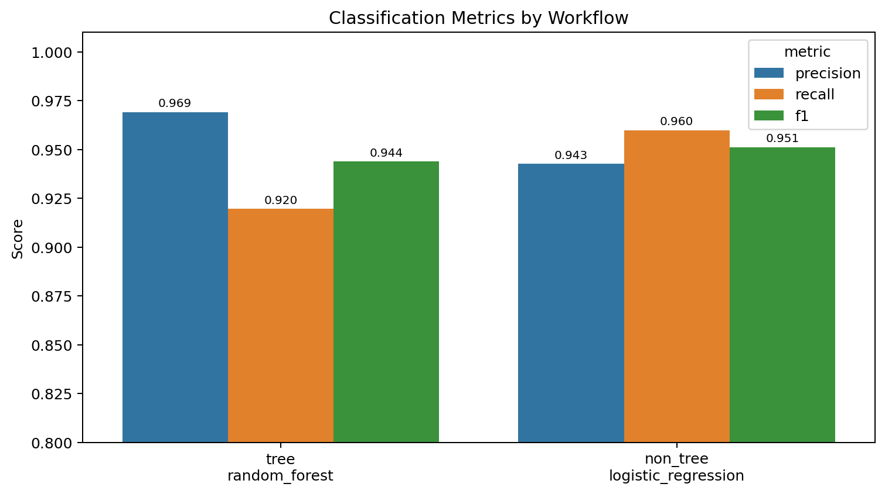
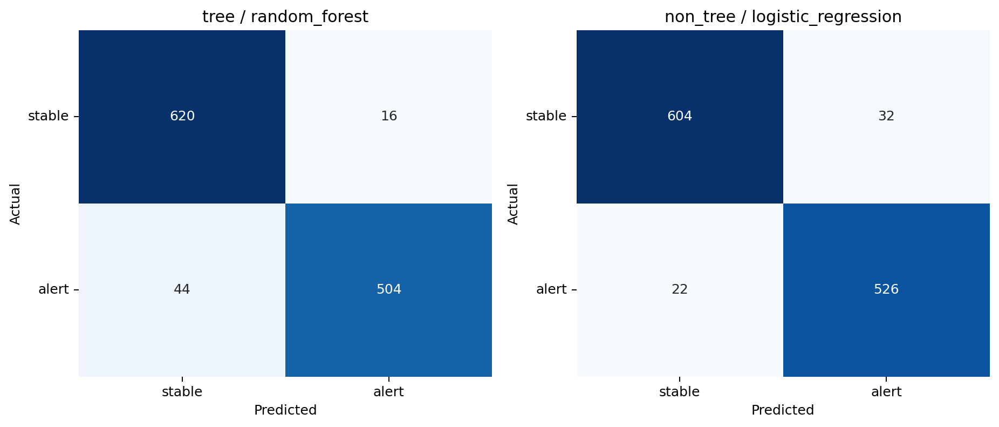
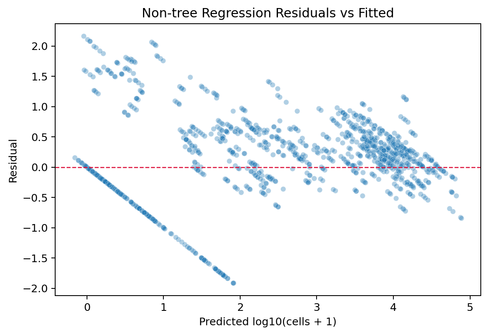
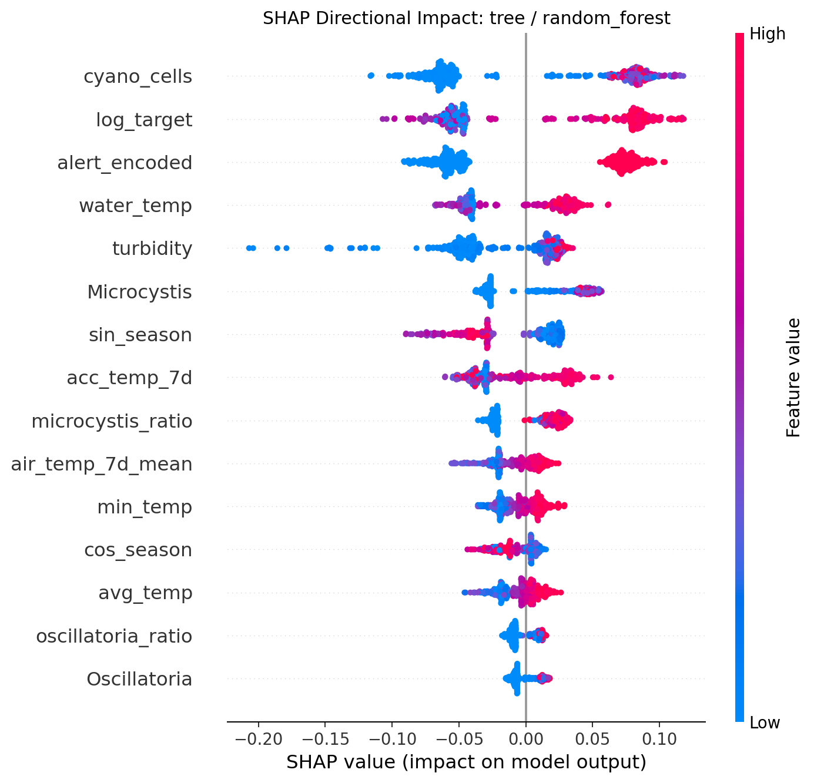
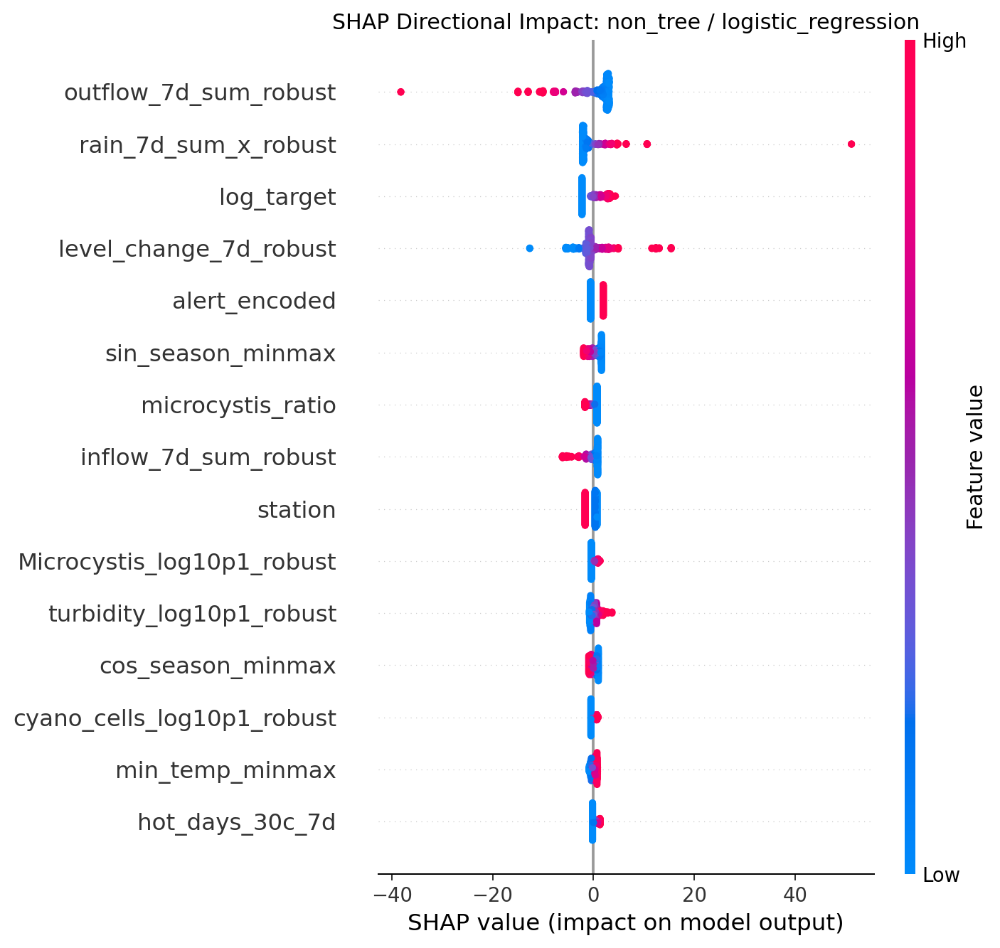
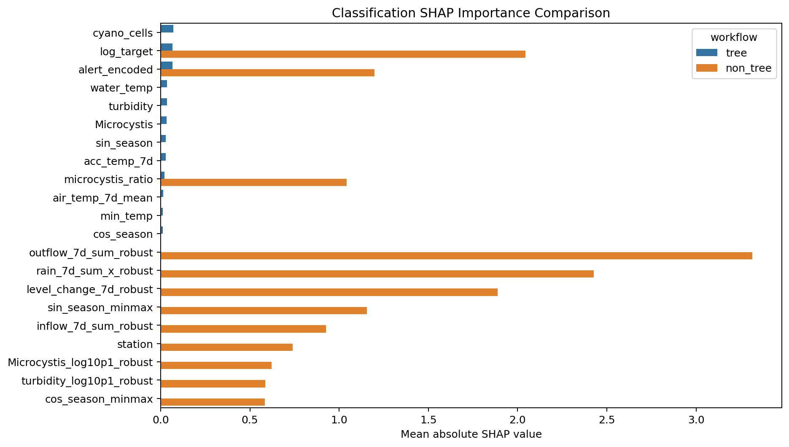

# 대청댐 조류경보 예측 모델링

대청댐 수질·조류·댐 운영·기상 데이터를 활용해 **다음 조사 시점의 유해남조류 세포수와 경보 위험 여부를 예측**하는 모델링 프로젝트입니다. 전처리팀이 만든 병합 데이터를 기반으로 트리 기반 모델과 비트리 스케일 모델을 모두 학습하고, 성능·해석·시각화 결과를 비교합니다.

## 빠른 실행

패키지 설치:

```bash
python -m pip install -r requirements.txt
```

트리/비트리 모델 전체 비교:

```bash
python - <<'PY'
from src.pipeline.runner import run_workflow_comparison

out = run_workflow_comparison(save=True)
print(out["summary"][["workflow", "selected_for", "model_name", "rmse", "recall", "precision", "f1"]])
PY
```

시각화와 진단 산출물 생성:

```bash
python -m src.pipeline.visualization
python -m src.pipeline.diagnostics
python -m src.pipeline.shap_compare
```

노트북으로 실행:

```bash
jupyter notebook model_training.ipynb
```

## 과제 목표

예측 target은 두 가지입니다.

| 구분 | Target | 의미 |
| --- | --- | --- |
| 회귀 | `next_log_cells` | 다음 조사 시점 유해남조류 세포수의 `log10(cells + 1)` 값 |
| 분류 | `target_alert_next` | 다음 조사 시점 세포수가 1,000 이상인지 여부 |

`log10(cells + 1)`을 쓰는 이유는 유해남조류 세포수가 0이 많고 일부 시점에서 수만~수십만까지 튀는 right-skew 분포이기 때문입니다. 로그 변환은 극단값 영향을 줄이고, 1,000/10,000 같은 경보 기준을 10배 단위로 설명하기 쉽게 만듭니다.

## 데이터와 전처리

전처리팀 원본은 `src/data/team-raw/`에 보관합니다.

| 파일 | 역할 |
| --- | --- |
| `daechung_for_merge_v1.csv` | 수질·조류·댐 운영 중심 base 데이터 |
| `ALGAE_MODEL_DATA_SCALED.csv` | station별 일 단위 기상 feature 데이터 |
| `ALGAE_DATA.csv` | 수질·조류·댐 운영 데이터와 station별 기상 데이터를 병합한 데이터 |

`ALGAE_DATA.csv`는 `date x loc_encoded x station` 구조입니다. 즉 하나의 조사일에 3개 수질 지점과 4개 기상 station이 결합되어 최대 12행이 만들어집니다. 이 구조 때문에 랜덤 split을 쓰면 같은 사건이 train과 valid에 동시에 들어갈 수 있어, 현재는 **date-level chronological holdout**을 사용합니다.

모델 입력은 두 가지로 나눴습니다.

| 입력 데이터 | 목적 | 처리 방식 |
| --- | --- | --- |
| `tree_gradient_boosting/algae_tree_station_expanded.csv` | 트리 기반 모델용 | 원 단위 feature 유지, `split`과 `target_alert_next`만 추가 |
| `non_tree_scaled/algae_non_tree_scaled_station_expanded.csv` | 선형/거리 기반 모델용 | 로그 변환, RobustScaler, MinMaxScaler, one-hot 적용 |

비트리 데이터에서는 조류 세포수·탁도·Chl-a는 `log10(x + 1)` 후 robust scaling하고, 강우/유입/방류/정체 지표는 `RobustScaler`, 수온/pH/DO/수위 등 제한 범위 변수는 `MinMaxScaler`를 적용했습니다. scaler는 train 구간에만 fit하고 valid 구간에는 transform만 적용해 preprocessing leakage를 막았습니다.

## 모델 선정과 학습

두 workflow를 같은 검증 기준으로 비교합니다.

| workflow | 회귀 후보 | 분류 후보 |
| --- | --- | --- |
| `tree` | LightGBM, XGBoost, HistGradientBoosting, RandomForest, CatBoost | LightGBM, XGBoost, HistGradientBoosting, RandomForest, CatBoost |
| `non_tree` | Ridge, ElasticNet, HuberRegressor, SVR-RBF, KNN Regressor | Logistic Regression, Calibrated Logistic Regression, SVC-RBF, KNN Classifier |

모델 후보는 데이터 특성과 운영 목적을 함께 고려해 선정했습니다. 조류 발생은 수온, 강우, 체류시간, 현재 세포수, 계절성처럼 비선형 상호작용이 강한 현상이므로 `LightGBM`, `XGBoost`, `HistGradientBoosting`, `RandomForest`, `CatBoost` 같은 트리 앙상블 계열을 비교했습니다. 이 계열은 변수 스케일에 덜 민감하고, 결측이나 이상치가 일부 있어도 비교적 안정적으로 작동하며, feature importance나 SHAP으로 운영자가 이해할 수 있는 설명을 만들기 쉽다는 장점이 있습니다.

반대로 비트리 workflow는 `Ridge`, `ElasticNet`, `HuberRegressor`, `Logistic Regression`, `Calibrated Logistic Regression`처럼 구조가 단순하거나 확률 보정이 가능한 모델을 포함했습니다. 이 모델들은 스케일에 민감하므로 별도의 로그 변환과 Robust/MinMax scaling을 적용한 입력을 사용했습니다. 비트리 모델을 함께 둔 이유는 단순 baseline을 만들기 위해서만이 아니라, 복잡한 트리 앙상블 모델보다 단순한 모델이 실제 holdout에서 더 안정적인지 확인하기 위해서입니다. 즉 현재 비교는 “복잡한 비선형 모델이 항상 우세한가?”를 검증하는 구조입니다.

LightGBM, XGBoost, CatBoost도 실제 후보에 포함되어 학습됩니다. 설치되어 있지 않은 환경에서는 해당 후보가 자동으로 건너뛰어질 수 있으므로, 실행 전 `python -m pip install -r requirements.txt`를 권장합니다.

학습과 검증은 랜덤 split이 아니라 시간 기준 holdout으로 수행했습니다. `ALGAE_DATA.csv`는 하나의 조사일에 여러 지점과 여러 기상 관측소가 결합되어 같은 날짜의 사건이 여러 행으로 반복되는 구조입니다. 따라서 랜덤으로 나누면 같은 조사일의 정보가 train과 valid에 동시에 들어가 validation leakage가 발생할 수 있습니다. 현재 방식은 과거 시점으로 학습하고 미래 시점을 검증하는 out-of-time validation에 가깝기 때문에, 실제 운영 상황인 “과거 데이터로 다음 시점을 예측한다”는 조건을 더 잘 반영합니다.

학습 흐름은 `src/pipeline/` 아래에 간단히 나누었습니다.

```text
data.py          데이터 로드, feature 선택, split
models.py        후보 모델 정의와 학습
evaluation.py    metric, threshold, best model 선택
artifacts.py     예측, feature importance, 모델/지표 저장
runner.py        단일 workflow 실행과 트리/비트리 비교
visualization.py 결과 시각화
diagnostics.py   비트리 잔차/가정 진단
shap_compare.py  Tree/Non-tree SHAP 비교
```

## 모델 비교 결과

현재 holdout 검증 결과는 다음과 같습니다.

| workflow | task | best model | 주요 성능 |
| --- | --- | --- | --- |
| tree | regression | CatBoost | RMSE 0.7200 / R2 0.8152 |
| tree | classification | RandomForest | Recall 0.9197 / Precision 0.9692 / F1 0.9438 |
| non_tree | regression | ElasticNet | RMSE 0.6773 / R2 0.8364 |
| non_tree | classification | Logistic Regression | Recall 0.9599 / Precision 0.9427 / F1 0.9512 |

현재 holdout 기준에서는 비트리 스케일 workflow가 회귀와 분류 모두에서 가장 좋은 성능을 보였습니다. 회귀에서는 `ElasticNet`의 RMSE가 0.6773으로 가장 낮아, 다음 조사 시점의 로그 세포수 예측 오차가 가장 작았습니다. 이는 로그 변환과 스케일링을 통해 극단적인 세포수와 수문 변수의 영향을 완화한 것이 선형 계열 모델에 유리하게 작용했음을 의미합니다.

분류에서는 `Logistic Regression`이 Recall 0.9599, F1 0.9512로 가장 우수했습니다. 조류경보 예측에서는 실제 위험 상황을 놓치는 미탐이 가장 큰 리스크이므로 Recall이 특히 중요합니다. Precision도 0.9427로 높게 유지되어, 단순히 위험을 과도하게 많이 찍어서 Recall만 높인 결과는 아닙니다. 따라서 현재 검증 결과만 놓고 보면 `non_tree + Logistic Regression`이 조기경보용 1차 추천 모델입니다.

추가 후보를 넣은 뒤 tree workflow의 best도 바뀌었습니다. 회귀에서는 `CatBoost`가 기존 LightGBM보다 낮은 RMSE를 보였고, 분류에서는 `RandomForest`가 tree 계열 중 가장 높은 Recall/F1을 보였습니다. 다만 전체 best는 여전히 non_tree workflow입니다. 운영 관점에서 비트리 모델은 “위험을 놓치지 않는 조기 감지 모델”, 트리 모델은 “비선형 구조를 확인하는 보조 비교 모델”로 해석할 수 있습니다. 최종 운영에서는 두 모델 중 하나만 고르기보다, Logistic Regression을 주 모델로 두고 RandomForest/CatBoost의 예측과 SHAP 해석을 보조 근거로 함께 확인하는 방식이 더 설득력 있습니다.

결론적으로 현재 실험의 핵심 메시지는 “복잡한 트리 앙상블 모델보다, 적절히 전처리된 비트리 모델이 현재 시간 기준 검증에서 더 우수했다”입니다. 이는 조류 데이터의 현재 feature set에서는 로그 변환, 누적 수문 변수, 현재 조류 상태가 충분히 강한 신호를 제공하고 있으며, 모델 복잡도를 높이는 것보다 누수 없는 전처리와 시간 기준 검증이 더 중요하다는 점을 보여줍니다.





## 비트리 모델 신뢰성 진단

비트리 workflow는 예측 성능은 좋지만, 선형 회귀 계열을 통계적 추론 모델처럼 해석하려면 잔차 가정을 확인해야 합니다.

| 진단 | 결과 | 해석 |
| --- | ---: | --- |
| Durbin-Watson | 0.4624 | 2에서 멀어 잔차 자기상관 가능성이 큼 |
| Breusch-Pagan p-value | 2.57e-34 | 등분산성 가정이 약함 |
| Jarque-Bera p-value | 6.55e-22 | 잔차 정규성 가정이 약함 |
| Logistic Brier Score | 0.0323 | 분류 확률 보정은 비교적 양호 |

비트리 모델은 성능이 좋더라도 두 가지 관점으로 나누어 해석해야 합니다. 첫째, 예측 모델로서의 신뢰성입니다. 현재 valid 구간에서 `ElasticNet`은 가장 낮은 RMSE를 보였고, `Logistic Regression`은 높은 Recall/F1과 낮은 Brier Score를 보였습니다. 따라서 “미래 holdout에서 예측이 잘 맞았는가?”라는 관점에서는 충분히 경쟁력 있는 모델입니다.

둘째, 통계적 추론 모델로서의 신뢰성입니다. Durbin-Watson 값이 0.4624로 2에서 크게 벗어나므로 잔차 자기상관 가능성이 큽니다. 이는 시계열 데이터에서 인접한 시점의 오차가 서로 독립이 아닐 수 있음을 의미합니다. Breusch-Pagan p-value가 매우 작아 등분산성도 약하고, Jarque-Bera p-value 역시 매우 작아 잔차 정규성도 만족한다고 보기 어렵습니다. 따라서 ElasticNet의 계수를 “이 변수가 원인이고, 이만큼 영향을 준다”는 식의 인과적 설명이나 p-value 중심의 통계 해석으로 사용하면 위험합니다.

정리하면 비트리 workflow는 **예측 목적에는 유효하지만, 전통적인 선형 회귀 가정에 기반한 인과 해석에는 제한이 있습니다.** 보고서에서는 이를 약점이라기보다 모델 사용 범위를 명확히 한 것으로 설명하는 것이 좋습니다. 즉 `ElasticNet`은 로그 세포수 예측 baseline으로 사용하고, `Logistic Regression`은 조기경보 분류 모델로 활용하되, 최종 의사결정에서는 SHAP 해석, RandomForest/CatBoost 비교 결과, 그리고 향후 walk-forward validation 결과를 함께 확인하는 방식이 적절합니다.



## SHAP 기반 원인 해석

Tree workflow의 best classification model인 RandomForest와 Non-tree workflow의 best classification model인 Logistic Regression에 대해 SHAP 비교를 수행했습니다.

| workflow | 주요 SHAP feature |
| --- | --- |
| tree / RandomForest | `cyano_cells`(현재 유해남조류 세포수), `log_target`(현재 유해남조류 세포수 로그값), `alert_encoded`(현재 조류경보 단계 인코딩), `water_temp`(수온), `turbidity`(탁도) |
| non_tree / Logistic Regression | `outflow_7d_sum_robust`(최근 7일 누적 방류량 스케일값), `rain_7d_sum_x_robust`(최근 7일 누적 강우량 스케일값), `log_target`(현재 유해남조류 세포수 로그값), `level_change_7d_robust`(최근 7일 수위 변화량 스케일값), `alert_encoded`(현재 조류경보 단계 인코딩) |

SHAP 시각화는 두 종류를 함께 저장합니다. `bar` 그래프는 평균 절대 SHAP 값을 기준으로 어떤 feature가 중요한지 순위를 보여주고, `beeswarm` 그래프는 각 관측치에서 feature 값이 예측을 어느 방향으로 밀었는지를 보여줍니다. 일반적으로 알려진 파란색/붉은색 SHAP 그림은 아래 beeswarm 그래프입니다. 붉은색은 해당 feature 값이 큰 관측치, 파란색은 해당 feature 값이 작은 관측치를 의미하고, x축 오른쪽은 경보 위험 예측을 높이는 방향, 왼쪽은 낮추는 방향으로 해석합니다.

Tree 모델은 현재 조류량·현재 경보 단계·수질 조건을 강하게 보고, Non-tree 모델은 수문 변화량·누적 강우/방류·현재 조류 상태를 강하게 봅니다. 두 모델이 서로 다른 관점의 신호를 사용하므로, 운영 보고에서는 beeswarm 그래프로 방향성을 설명하고, 비교 bar 그래프로 workflow별 중요도 차이를 요약하는 것이 좋습니다.







## 산출물

```text
artifacts/workflow_comparison_summary.csv
artifacts/figures/
artifacts/diagnostics/
artifacts/shap/

artifacts/tree_gradient_boosting/
  models/
  metrics/
  predictions/
  explain/

artifacts/non_tree_scaled/
  models/
  metrics/
  predictions/
  explain/
```

자세한 문서:

- [데이터/컬럼 사전](docs/data_dictionary.md)
- [파이프라인 도식 HTML](docs/modeling_pipeline_diagram.html)
- [파이프라인 도식 Mermaid](docs/modeling_pipeline_diagram.md)
- [워크플로 상세 분석](docs/modeling_workflow_analysis.md)
- [모델 결과 최종 정리](docs/model_results_summary.md)

## 다음 과제

현재 결과는 단일 chronological holdout 기준입니다. 즉 2016-04-04부터 2024-04-29까지의 과거 구간으로 학습하고, 2024-05-07부터 2025-12-15까지의 미래 구간으로 한 번 검증한 결과입니다. 따라서 현재 성능이 특정 valid 기간에만 잘 맞은 것인지, 여러 미래 구간에서도 안정적으로 유지되는지 추가 확인이 필요합니다.

첫 번째 추가 과제는 `walk-forward validation`입니다. 이는 학습 기간을 점진적으로 늘려가며 이후 시점을 반복 검증하는 방식입니다. 예를 들어 2016~2021년으로 학습해 2022년을 검증하고, 2016~2022년으로 학습해 2023년을 검증하는 식입니다. 이 과정을 통해 모델이 특정 연도에만 우연히 잘 맞은 것이 아니라, 시간에 따라 반복적으로 안정적인 예측력을 보이는지 확인할 수 있습니다.

두 번째 추가 과제는 트리 기반 모델의 hyperparameter tuning입니다. 현재 LightGBM, XGBoost, RandomForest, CatBoost는 기본 후보 모델 수준으로 비교했기 때문에, 트리 모델의 최적 성능을 완전히 확인했다고 보기는 어렵습니다. `max_depth`, `learning_rate`, `n_estimators`, `num_leaves`, `subsample`, `colsample_bytree`, `reg_alpha`, `reg_lambda` 같은 설정을 조정해 과적합을 줄이고 미래 검증 성능을 개선할 필요가 있습니다. 현재 비트리 모델이 우세하더라도, 튜닝된 트리 모델은 비선형 상호작용을 더 잘 포착할 수 있으므로 중요한 비교군으로 유지해야 합니다.

세 번째 추가 과제는 classification threshold tuning입니다. 분류 모델은 내부적으로 경보 위험 확률을 예측하고, 보통 0.5를 기준으로 위험/비위험을 나눕니다. 하지만 조류경보 예측에서는 실제 위험을 놓치는 미탐이 더 큰 리스크이므로, 기본 threshold가 최선이라고 단정할 수 없습니다. threshold를 낮추면 Recall은 올라가고 Precision은 낮아질 수 있으며, threshold를 높이면 Precision은 올라가고 Recall은 낮아질 수 있습니다. 따라서 운영 목적에 맞게 Recall과 Precision의 균형점을 선택해야 합니다.

그 외에도 `log_target` 포함/제외 ablation, station-expanded 구조와 대표 station 집계 방식 비교가 필요합니다. 이번 버전에서는 CatBoost, RandomForest, HuberRegressor, Calibrated Logistic Regression을 후보에 추가했으므로, 다음 단계에서는 이 후보들을 포함한 상태로 walk-forward validation을 수행해야 합니다. 딥러닝은 현재 데이터가 정형 tabular 구조이고 표본 수가 크지 않기 때문에 우선순위가 높지 않습니다. 먼저 walk-forward validation, 트리 모델 tuning, threshold tuning으로 현재 모델의 안정성과 운영 적합성을 확인한 뒤, 성능 개선 여지가 남을 때 추가 실험으로 검토하는 것이 적절합니다.
