# 대청댐 조류경보 예측 모델링 파이프라인 도식

아래 도식은 현재 프로젝트의 실제 파이프라인 기준이다.

```mermaid
flowchart LR
    A["1. 전처리팀 원본 데이터<br/>team-raw<br/><br/>ALGAE_DATA.csv<br/>ALGAE_MODEL_DATA_SCALED.csv<br/>daechung_for_merge_v1.csv"]
    B["2. 모델 입력 데이터 생성<br/>src/utils/build_model_datasets.py<br/><br/>트리용 / 비트리용 데이터 분리"]
    C1["3-A. Tree Workflow Dataset<br/>algae_tree_station_expanded.csv<br/><br/>ALGAE_DATA + split + target_alert_next<br/>원 단위 feature 유지"]
    C2["3-B. Non-tree Scaled Dataset<br/>algae_non_tree_scaled_station_expanded.csv<br/><br/>로그 변환 + RobustScaler + MinMaxScaler<br/>station/location one-hot"]
    D["4. Target & Split<br/><br/>회귀 target: next_log_cells<br/>분류 target: target_alert_next<br/>split: date-level chronological holdout"]
    E1["5-A. Tree Models<br/><br/>LightGBM<br/>XGBoost<br/>HistGradientBoosting"]
    E2["5-B. Non-tree Models<br/><br/>ElasticNet / Ridge / SVR / KNN<br/>Logistic Regression / SVC / KNN"]
    F["6. Evaluation<br/><br/>Regression: MAE, RMSE, R2, cells metrics<br/>Classification: Precision, Recall, F1, ROC-AUC, PR-AUC<br/>Threshold candidates"]
    G["7. Model Selection<br/><br/>Regression: RMSE 최소<br/>Classification: Recall 우선<br/>workflow별 best model 선택"]
    H["8. Artifacts<br/><br/>models/*.pkl<br/>metrics/*.json, *.csv<br/>predictions/*.csv<br/>explain/feature_importance.csv"]
    I["9. Visualization & Report<br/><br/>artifacts/figures/*.png<br/>workflow_comparison_summary.csv<br/>docs/model_results_summary.md"]

    A --> B
    B --> C1
    B --> C2
    C1 --> D
    C2 --> D
    D --> E1
    D --> E2
    E1 --> F
    E2 --> F
    F --> G
    G --> H
    H --> I
```

## 현재 최종 비교 결과

| workflow | task | best model | metric |
| --- | --- | --- | --- |
| tree | regression | LightGBM | RMSE 0.7339 |
| tree | classification | XGBoost | Recall 0.8960 / Precision 0.9781 / F1 0.9352 |
| non_tree | regression | ElasticNet | RMSE 0.6773 |
| non_tree | classification | Logistic Regression | Recall 0.9599 / Precision 0.9427 / F1 0.9512 |

