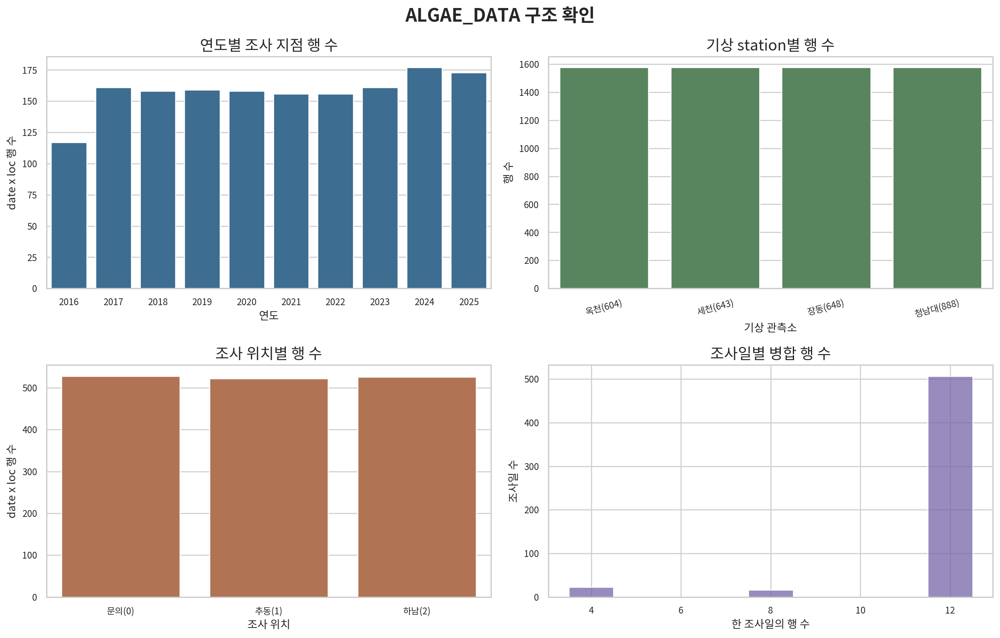
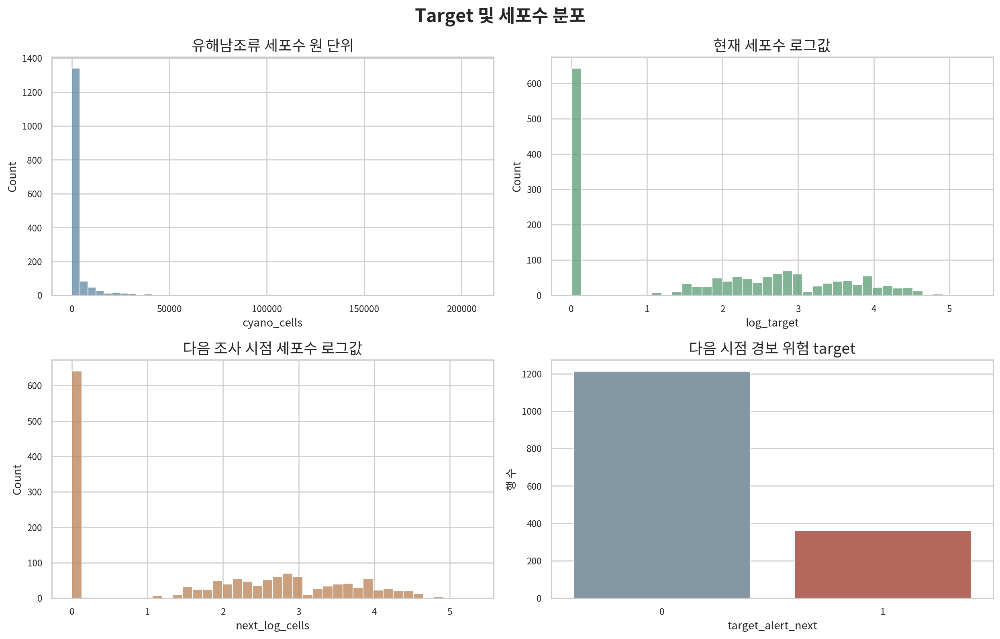
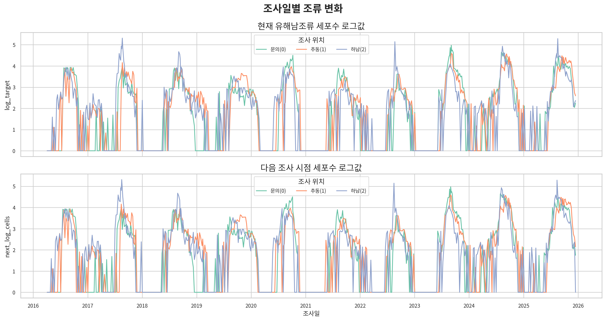
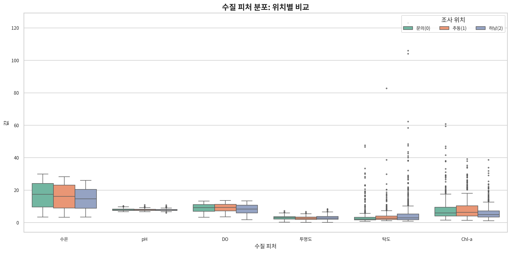
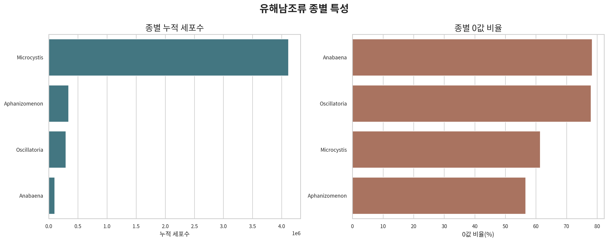
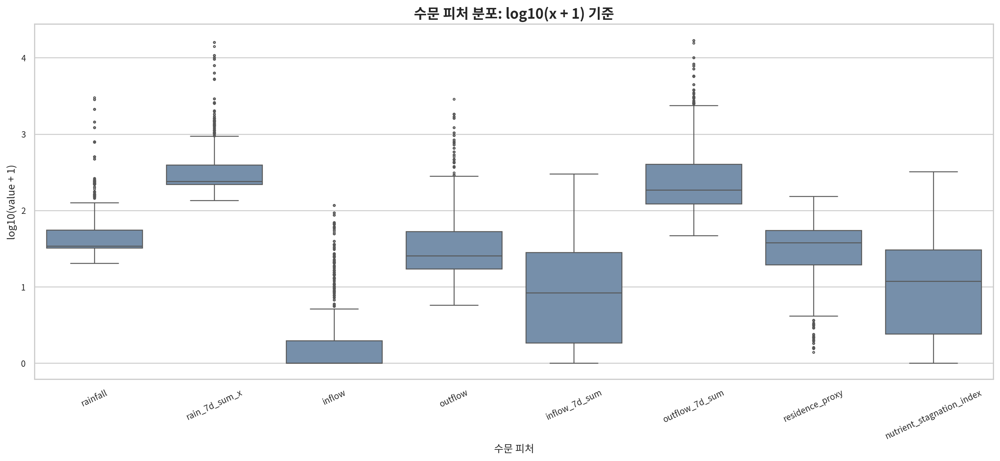
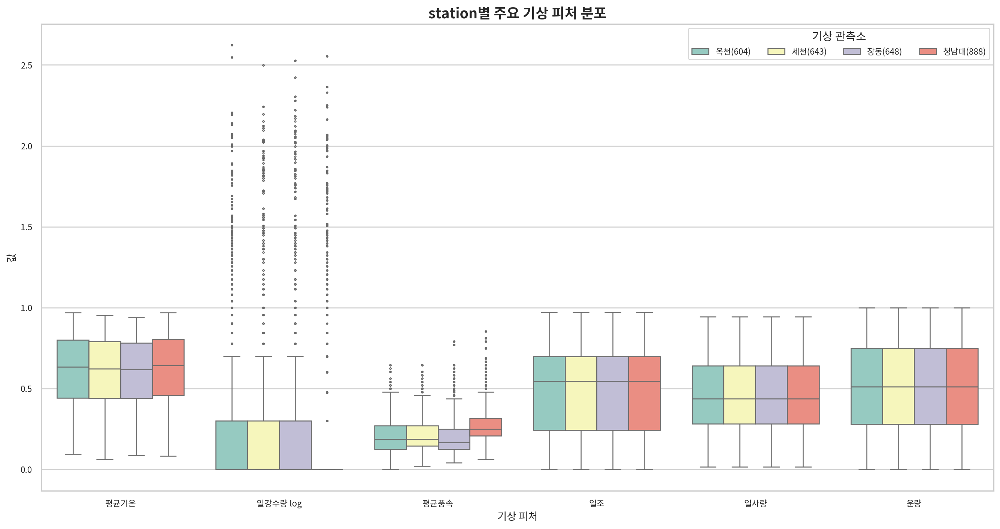
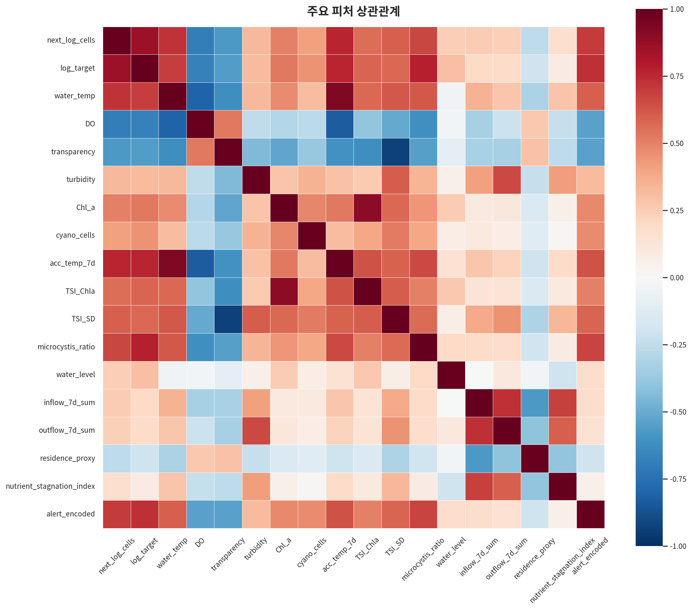

# EDA 그래프별 해석

이 문서는 `eda/figures`에 저장된 ALGAE_DATA EDA 그래프를 각각 `서론 - 본론 - 결론 - 요약` 형식으로 설명한다.

## 1. `00_dataset_structure.png`



### 서론

이 그래프는 `ALGAE_DATA.csv`가 어떤 구조로 구성되어 있는지 확인하기 위한 시각화다. 모델링 전에 데이터가 제대로 병합되었는지, 조사 위치와 기상 station이 어떻게 분포하는지 보는 목적이 있다.

### 본론

그래프를 보면 기상 station은 네 개로 구성된다.

```text
옥천(604)
세천(643)
장동(648)
청남대(888)
```

조사 위치는 세 개다.

```text
문의(0)
추동(1)
하남(2)
```

또한 한 조사일에 여러 행이 존재하는 구조도 확인할 수 있다. 이는 하나의 수질·조류 조사 데이터에 여러 station의 기상 정보가 붙었기 때문이다.

### 결론

`ALGAE_DATA.csv`는 단순한 수질 데이터가 아니라 다음 구조로 확장된 병합 데이터다.

```text
조사일 x 조사 위치 x 기상 station
```

### 요약

> 이 그래프는 `ALGAE_DATA.csv`가 수질·조류 데이터에 station별 기상 데이터가 결합된 구조임을 보여준다.

## 2. `01_target_distribution.png`



### 서론

이 그래프는 모델이 예측해야 하는 핵심 target의 분포를 확인하기 위한 시각화다. 특히 유해남조류 세포수가 어떤 형태의 분포를 가지는지 보는 것이 중요하다.

### 본론

원 단위 `cyano_cells`는 대부분 낮은 값에 몰려 있고, 일부 시점에서 매우 큰 값이 나타난다. 즉 분포가 오른쪽으로 길게 치우쳐 있다.

반면 `log_target`, `next_log_cells`는 로그 변환을 거치면서 분포가 훨씬 완만해진다. 이는 `log10(cells + 1)` 변환이 극단값 영향을 줄여준다는 뜻이다.

`target_alert_next`는 다음 조사 시점에 경보 기준을 넘는지 여부를 나타낸다. 위험/비위험 class가 완전히 균등하지 않기 때문에 단순 accuracy만 보면 부족하다.

### 결론

유해남조류 세포수는 원 단위로 모델링하기 어렵고, 로그 변환이 필요하다. 또한 분류 문제에서는 실제 위험을 놓치지 않는 Recall이 중요하다.

### 요약

> 이 그래프는 조류 세포수가 극단값이 많은 분포이므로 로그 변환이 필요하고, 경보 분류에서는 class 불균형을 고려해야 함을 보여준다.

## 3. `02_target_time_series_by_location.png`



### 서론

이 그래프는 조사 위치별로 조류 세포수 로그값이 시간에 따라 어떻게 변하는지 보여준다. 위치별 조류 발생 패턴과 시간적 변동성을 확인하기 위한 그래프다.

### 본론

`문의(0)`, `추동(1)`, `하남(2)`은 같은 시기에 비슷하게 움직이기도 하지만, 특정 시점에서는 위치별 차이가 나타난다.

또 조류 세포수는 부드럽게 증가하고 감소하는 형태라기보다, 특정 시점에 급격히 튀는 peak가 반복된다. 이런 특성 때문에 이 데이터는 전형적인 매끄러운 시계열이라기보다 이벤트성 tabular 데이터에 가깝다고 볼 수 있다.

### 결론

조류 발생은 위치별 차이가 있고, 특정 시점에 급격한 peak가 나타난다. 따라서 모델링에서는 위치 정보와 이벤트성 변동을 함께 고려해야 한다.

### 요약

> 이 그래프는 조류 발생이 위치별로 다르고, 시간적으로 매끄럽기보다 이벤트성 peak가 강하다는 점을 보여준다.

## 4. `03_water_quality_boxplot_by_location.png`



### 서론

이 그래프는 수질 피처들이 조사 위치별로 어떻게 다른지 비교하기 위한 시각화다. 조류 발생 조건이 위치별로 다를 수 있는지 확인하는 데 목적이 있다.

### 본론

포함된 피처는 다음과 같다.

```text
수온
pH
DO
투명도
탁도
Chl-a
```

수온과 Chl-a는 조류 성장과 직접적으로 연결될 수 있는 변수다. 탁도는 일부 구간에서 큰 이상치가 보이며, 강우나 탁수 유입 이벤트의 영향을 받을 수 있다.

위치별로 분포가 완전히 같지 않기 때문에, `loc_encoded`는 단순한 ID가 아니라 공간적 차이를 반영하는 피처로 볼 수 있다.

### 결론

조사 위치별로 수질 조건에 차이가 존재한다. 따라서 위치 정보는 모델에서 제거하기보다 유지하는 것이 타당하다.

### 요약

> 이 그래프는 수온, 탁도, Chl-a 등 주요 수질 피처가 위치별로 차이를 보이며, 위치 정보가 예측에 의미 있을 수 있음을 보여준다.

## 5. `04_algae_species_summary.png`



### 서론

이 그래프는 유해남조류를 구성하는 종별 특성을 보기 위한 시각화다. 총 세포수뿐 아니라 어떤 종이 주로 발생하는지 확인하는 목적이 있다.

### 본론

종별 누적 세포수를 보면 `Microcystis`의 비중이 크다. 반면 `Anabaena`, `Oscillatoria` 등은 0값 비율이 높아 특정 시기에만 나타나는 경향이 강하다.

이 말은 유해남조류 총량만 보는 것보다, 어떤 종이 우점하는지도 중요하다는 뜻이다. 모델 해석에서 `microcystis_ratio`가 의미 있는 이유도 여기서 설명된다.

### 결론

유해남조류 발생은 종별로 고르게 나타나는 것이 아니라, 특정 종 중심으로 나타나는 경향이 있다. 특히 `Microcystis`는 중요한 해석 대상이다.

### 요약

> 이 그래프는 유해남조류 총량뿐 아니라 종별 우점 구조가 중요하며, 특히 Microcystis가 핵심 종임을 보여준다.

## 6. `05_hydrology_log_boxplot.png`



### 서론

이 그래프는 강우, 유입, 방류, 체류시간 등 수문 피처의 분포를 확인하기 위한 시각화다. 수문 변수는 극단값이 많기 때문에 로그 스케일로 표현했다.

### 본론

`rainfall`, `rain_7d_sum_x`, `outflow_7d_sum` 같은 변수는 일부 시점에서 매우 크게 튀는 특성이 있다. 이는 폭우, 급방류, 유입량 증가 같은 이벤트 때문이다.

`residence_proxy`, `nutrient_stagnation_index`는 물이 얼마나 정체되는지, 영양염류가 들어왔는데 물이 빠지지 않는 조건을 나타내는 파생변수다.

이런 변수들은 단순 선형 상관보다는 특정 조건에서 조류 증가에 영향을 줄 가능성이 크다.

### 결론

수문 피처는 이벤트성이 강하고 극단값이 많다. 따라서 RobustScaler나 로그 변환이 필요하고, 비선형 모델에서도 중요한 후보가 된다.

### 요약

> 이 그래프는 강우·유입·방류 관련 수문 피처가 극단값이 많은 이벤트성 변수이며, 조류 발생 메커니즘 설명에 중요함을 보여준다.

## 7. `06_weather_boxplot_by_station.png`



### 서론

이 그래프는 기상 station별 주요 기상 피처 분포를 비교하기 위한 시각화다. 기상 관측소별 차이가 실제로 존재하는지 확인하는 목적이 있다.

### 본론

station은 다음 네 개다.

```text
옥천(604)
세천(643)
장동(648)
청남대(888)
```

평균기온, 강수량, 평균풍속, 일조, 일사량, 운량이 station별로 완전히 동일하지 않다. 즉 기상 조건은 조사일 기준으로 단일 값이 아니라, station 위치에 따라 다르게 들어가고 있다.

이 그래프는 `ALGAE_DATA.csv`가 station별 기상 데이터와 병합된 데이터라는 점을 시각적으로 보여준다.

### 결론

기상 station별 차이가 존재하므로 station 정보를 모델에 포함하는 것이 의미 있다. 특히 강수, 풍속, 일사량은 조류 발생 조건과 연결될 수 있다.

### 요약

> 이 그래프는 station별 기상 조건 차이가 존재하며, ALGAE_DATA가 기상 관측소 정보를 포함한 병합 데이터임을 보여준다.

## 8. `07_feature_correlation_heatmap.png`



### 서론

이 그래프는 주요 피처 간 상관관계를 확인하기 위한 heatmap이다. 어떤 변수가 target과 함께 움직이는지, 변수들끼리 중복 정보가 있는지 확인할 수 있다.

### 본론

`log_target`과 `next_log_cells`는 강하게 관련되어 있다. 즉 현재 조류 세포수가 높으면 다음 조사 시점에도 높을 가능성이 크다는 뜻이다.

`water_temp`, `acc_temp_7d`도 target과 관련이 크다. 이는 수온과 누적 수온이 조류 성장 조건과 연결된다는 도메인 지식과도 맞다.

반대로 `DO`, `transparency`는 조류 증가와 반대 방향으로 움직일 가능성이 있다. 수문 변수들은 단순 상관만으로는 강하게 보이지 않을 수 있지만, 이벤트 조건에서 중요하게 작동할 수 있다.

### 결론

현재 조류 상태, 수온, 누적 수온, 경보 상태는 target과 강한 관련이 있다. 이 때문에 Logistic Regression, ElasticNet, HuberRegressor 같은 비트리 모델이 좋은 성능을 낼 수 있었다.

### 요약

> 이 그래프는 현재 조류 상태와 수온 계열 피처가 다음 조류 세포수와 강하게 관련되며, 모델이 사용할 핵심 신호가 데이터 안에 존재함을 보여준다.
